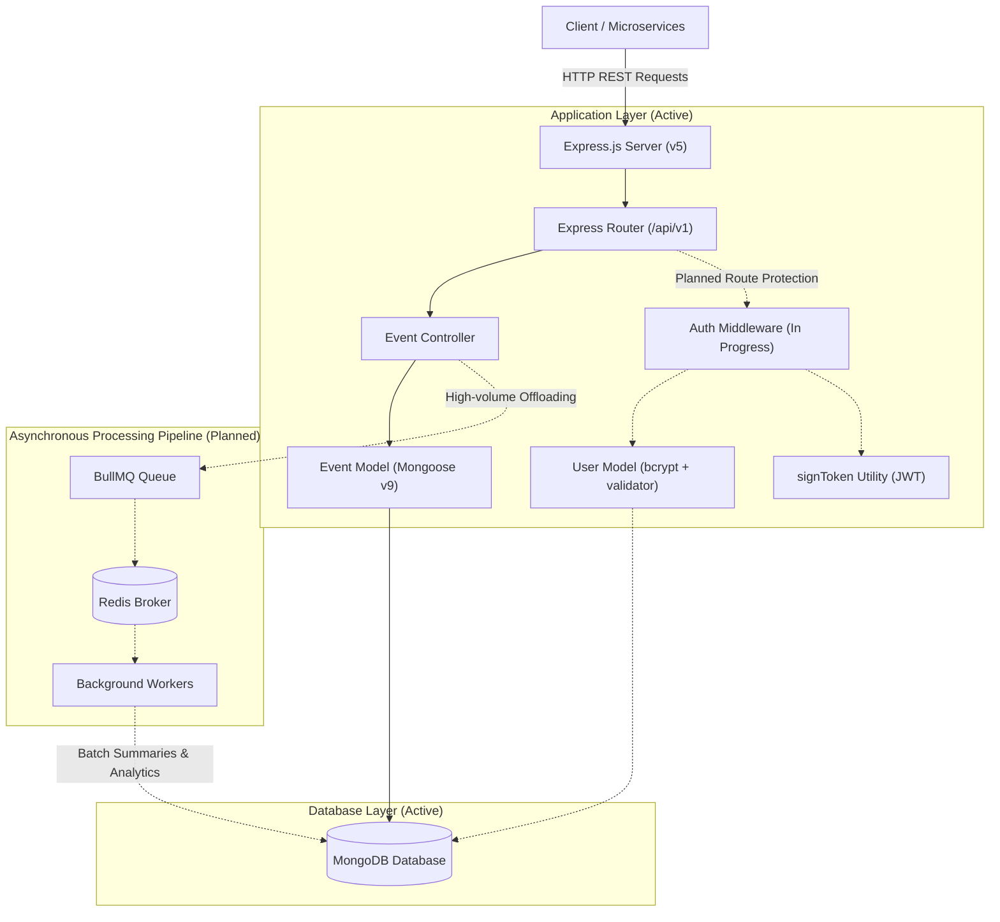

# Event & Traffic Monitoring System

A backend **Event and Traffic Monitoring System** built with **Node.js**, **Express.js (v5)**, and **MongoDB (Mongoose v9)**. The platform provides structured REST APIs for logging, categorizing, querying, and analyzing real-time application events, system errors, and traffic logs, with an architecture designed to support asynchronous queue-based processing.

---

## 🏗️ System Architecture & Data Flow



---

## 🚀 Tech Stack

### Active & Core

- **Runtime Environment:** Node.js (CommonJS)
- **Web Framework:** Express.js (v5)
- **Database & ODM:** MongoDB via Mongoose (v9)
- **Security & Utilities:** `bcrypt` (password hashing), `jsonwebtoken` (JWT creation), `validator` (schema string/email validation)
- **Environment Management:** `dotenv`
- **Development Tooling:** `nodemon`
- **Code Quality & Formatting:** ESLint & Prettier

### Planned / Roadmap

- **Message Broker & Task Queue:** BullMQ with Redis (for asynchronous event buffering and batch ingestion)
- **Worker Processes:** Dedicated background consumers for metric aggregation and traffic summaries

---

## 📁 Project Architecture & Layout

```text
Event-And-Traffic-Monitoring-System/
├── .agents/
│   └── AGENTS.md             # AI Agent guidelines and repository rules
├── .eslintrc.json            # ESLint code quality configuration
├── .gitignore                # Git exclusion rules
├── .prettierrc               # Prettier formatting rules
├── index.js                  # Server bootstrap & API entry point
├── package.json              # NPM dependencies and scripts
└── src/                      # Application source code
    ├── config/
    │   └── db.js             # Async Mongoose database connection setup
    ├── controllers/
    │   ├── authController.js # Auth route handlers (In Progress)
    │   └── eventController.js# Event creation, querying, pagination & filtering
    ├── middleware/           # Auth & validation middleware (Planned / In Progress)
    ├── models/
    │   ├── eventModel.js     # Mongoose schema for system and user events
    │   └── userModel.js      # Mongoose schema for user accounts (with bcrypt hashing)
    ├── queues/               # BullMQ queue producers (Planned)
    ├── routes/
    │   └── eventRoutes.js    # Express route declarations for events
    ├── services/             # Core business logic & transformations (Planned)
    ├── utils/
    │   └── signToken.js      # JWT token signing helper
    └── workers/              # Background processing workers (Planned)
```

---

## 📌 Current Status & Development Roadmap

### ✅ Implemented Features

- **Server Bootstrap & Health Monitoring:** Express v5 application lifecycle with `GET /api/v1/health`.
- **Database Persistence:** Asynchronous MongoDB connection with connection event handling and error safety.
- **Event Logging API:**
  - `POST /api/v1/events`: Ingests and validates event records into MongoDB.
  - `GET /api/v1/events`: Queries event logs with **pagination** (`page`, `limit`) and **filtering** (`severity`, `eventType`).
- **Data Models:**
  - `Event` schema supporting event categories, source tracking, severity levels, and summary tracking flags.
  - `User` schema featuring email validation and pre-save password hashing.
- **Token Utility:** Standardized JWT signing helper (`signToken.js`) using HMAC-SHA256.

### 🚧 In Progress & Planned Roadmap

- **Authentication Endpoints & Middleware:** Completing `authController.js` (signup/login handlers) and JWT validation route middleware (`protect`).
- **Asynchronous Queue Integration:** Offloading high-throughput event logging to BullMQ & Redis queues.
- **Background Event Summarization:** Background workers to aggregate logs and toggle `isSummarized` flags.
- **Rate Limiting & Advanced Validation:** Express rate limiting for abuse prevention.

---

## 🔐 Authentication & Security Status

| Component                                  | Status               | Details                                                                                                                 |
| :----------------------------------------- | :------------------- | :---------------------------------------------------------------------------------------------------------------------- |
| **User Model (`userModel.js`)**            | **Implemented**      | Strict schema validation with `validator.isEmail`, pre-save `bcrypt` hashing (salt rounds: 12), and admin flag support. |
| **Token Generation (`signToken.js`)**      | **Implemented**      | Helper creating signed JWT tokens configured with `JWT_SECRET` and `JWT_EXPIRES_IN`.                                    |
| **Auth Controllers (`authController.js`)** | **In Progress**      | Registration (`/signup`) and Login (`/login`) controller handlers under development.                                    |
| **Route Protection Middleware**            | **Planned**          | JWT verification middleware (`protect`) to authenticate incoming requests for secure routes.                            |
| **Current Route Access**                   | **Public (Interim)** | All current endpoints (`/api/v1/events`, `/api/v1/health`) are publicly accessible until auth middleware is mounted.    |

---

## 📊 Data Models

### 1. Event Model (`src/models/eventModel.js`)

| Field          | Type       | Validation / Options                                                       | Description                                 |
| :------------- | :--------- | :------------------------------------------------------------------------- | :------------------------------------------ |
| `eventType`    | `String`   | **Required**, Enum: `['Login', 'SignUp', 'Server Crash', 'Traffic Spike']` | Categorization of the event                 |
| `source`       | `String`   | **Required**                                                               | Source module or service emitting the event |
| `message`      | `String`   | **Required**                                                               | Descriptive event message                   |
| `severity`     | `String`   | **Required**, Enum: `['Critical', 'High', 'Medium', 'Low']`                | Severity level of the event                 |
| `isSummarized` | `Boolean`  | **Required**, Default: `false`                                             | Aggregation flag for background workers     |
| `submittedBy`  | `ObjectId` | Ref: `User` (Optional)                                                     | Reference to associated user                |
| `createdAt`    | `Date`     | Auto-generated timestamp                                                   | Timestamp when event was created            |
| `updatedAt`    | `Date`     | Auto-generated timestamp                                                   | Timestamp when event was last modified      |

### 2. User Model (`src/models/userModel.js`)

| Field      | Type      | Validation / Options                  | Description                                  |
| :--------- | :-------- | :------------------------------------ | :------------------------------------------- |
| `fullName` | `String`  | **Required**                          | Full name of the user                        |
| `email`    | `String`  | **Required**, Unique, Email Validator | User email address                           |
| `password` | `String`  | **Required**, Min length: 8           | Password (automatically hashed via `bcrypt`) |
| `isAdmin`  | `Boolean` | Default: `false`                      | Administrator role flag                      |

---

## 📡 API Endpoints Reference

### Base URL: `/api/v1`

| Method | Endpoint  | Description                                   | Auth Status             |
| :----- | :-------- | :-------------------------------------------- | :---------------------- |
| `GET`  | `/health` | Server uptime and health check                | Public                  |
| `POST` | `/events` | Create and store a new event record           | Public _(Auth Planned)_ |
| `GET`  | `/events` | Retrieve paginated and filtered event records | Public _(Auth Planned)_ |

---

### Endpoint Details

#### 1. Health Check

- **URL:** `GET /api/v1/health`
- **Response:** `200 OK`
  ```json
  {
    "status": "ok",
    "message": "Alive"
  }
  ```

#### 2. Create an Event

- **URL:** `POST /api/v1/events`
- **Headers:** `Content-Type: application/json`
- **Request Body Example:**
  ```json
  {
    "eventType": "Server Crash",
    "source": "PaymentService",
    "message": "Database connection timeout during checkout",
    "severity": "Critical"
  }
  ```
- **Response:** `201 Created`
  ```json
  {
    "status": "success",
    "data": {
      "event": {
        "_id": "66bc901a5e12f4001a1b2c3d",
        "eventType": "Server Crash",
        "source": "PaymentService",
        "message": "Database connection timeout during checkout",
        "severity": "Critical",
        "isSummarized": false,
        "createdAt": "2026-08-16T09:00:00.000Z",
        "updatedAt": "2026-08-16T09:00:00.000Z"
      }
    }
  }
  ```

#### 3. Get All Events (with Pagination & Filtering)

- **URL:** `GET /api/v1/events`
- **Query Parameters:**
  - `page` _(optional, default: `1`)_: Page number.
  - `limit` _(optional, default: `10`)_: Number of items per page.
  - `severity` _(optional)_: Filter by `Critical`, `High`, `Medium`, or `Low`.
  - `eventType` _(optional)_: Filter by `Login`, `SignUp`, `Server Crash`, or `Traffic Spike`.
- **Example Request:** `GET /api/v1/events?page=1&limit=5&severity=Critical`
- **Response:** `200 OK`
  ```json
  {
    "status": "success",
    "results": 1,
    "data": {
      "events": [
        {
          "_id": "66bc901a5e12f4001a1b2c3d",
          "eventType": "Server Crash",
          "source": "PaymentService",
          "message": "Database connection timeout during checkout",
          "severity": "Critical",
          "isSummarized": false,
          "createdAt": "2026-08-16T09:00:00.000Z",
          "updatedAt": "2026-08-16T09:00:00.000Z"
        }
      ]
    }
  }
  ```

---

## ⚙️ Getting Started

### Prerequisites

- [Node.js](https://nodejs.org/) (v18+ recommended)
- [MongoDB](https://www.mongodb.com/) (Local instance or MongoDB Atlas)

### 1. Installation

```bash
git clone https://github.com/theprogrammer141/event-and-traffic-monitoring-system.git
cd Event-And-Traffic-Monitoring-System
npm install
```

### 2. Environment Setup

Create a `.env` file in the root directory:

```env
PORT=3000
MONGO_URI=mongodb://localhost:27017/event_monitoring_db
JWT_SECRET=your_super_secret_jwt_key_here
JWT_EXPIRES_IN=90d
```

### 3. Running the Application

- **Development Mode (with auto-reload):**
  ```bash
  npm run dev
  ```
- **Production Mode:**
  ```bash
  npm start
  ```

---

## 🛠️ Code Quality & Utility Scripts

| Command                | Description                              |
| :--------------------- | :--------------------------------------- |
| `npm run dev`          | Start development server using `nodemon` |
| `npm start`            | Run production server                    |
| `npm run lint`         | Run ESLint checks                        |
| `npm run lint:fix`     | Automatically fix ESLint issues          |
| `npm run format`       | Format codebase using Prettier           |
| `npm run format:check` | Check code formatting compliance         |

---

## 📜 License

This project is licensed under the **GNU General Public License v3.0 (GPL-3.0)** - see the [LICENSE](LICENSE) file for details.
